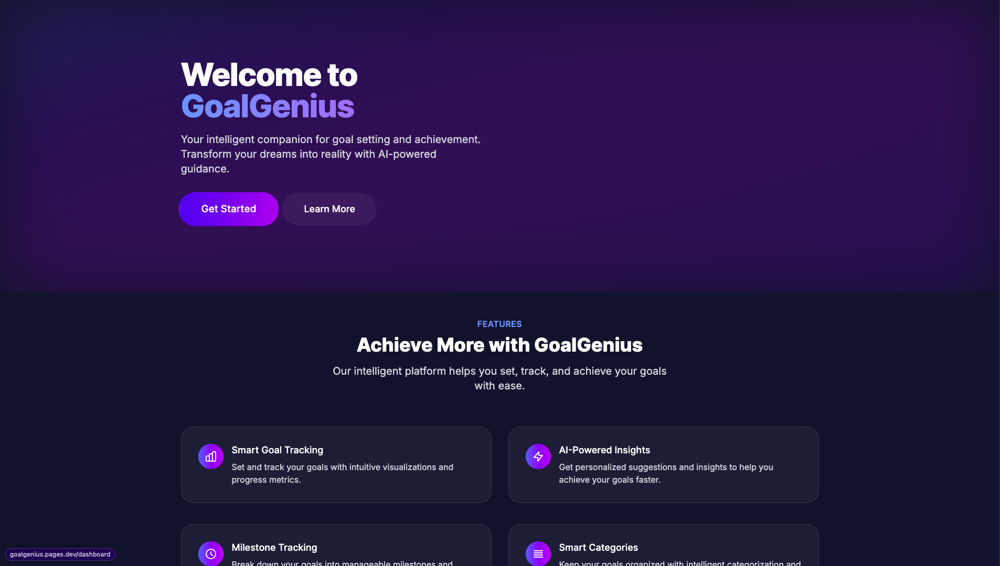

# GoalGenius 🎯

<div align="center">

[](https://nextjs.org/)
[](https://www.typescriptlang.org/)
[](https://tailwindcss.com/)
[](LICENSE)

Transform your aspirations into achievements with GoalGenius - your intelligent goal tracking companion.

[View Demo](https://goalgenius.online) · [Report Bug](https://github.com/ismailco/goalgenius/issues) · [Request Feature](https://github.com/ismailco/goalgenius/issues)



</div>

## ✨ Features

- 📊 **Interactive Dashboard** - Visual progress tracking and goal organization
- 📝 **Smart Notes** - Capture and organize your thoughts with rich formatting
- ✅ **Todo Management** - Prioritize and track your daily tasks
- 📈 **Daily Check-ins** - Monitor your progress with mood and energy tracking
- 🎯 **Milestone Timeline** - Break down goals into achievable milestones
- 🌙 **Dark Mode** - Beautiful dark theme with glass-morphism effects
- 📱 **Responsive Design** - Seamless experience across all devices
- ⚡ **PWA Support** - Install as a native app on any device

## 🚀 Getting Started

### Prerequisites

- Node.js 18+ and npm
- Git

### Installation

1. Clone the repository
```bash
git clone https://github.com/ismailco/goalgenius.git
cd goalgenius
```

2. Install dependencies
```bash
npm install
```

3. Start the development server
```bash
npm run dev
```

4. Open [http://localhost:3000](http://localhost:3000) in your browser

## 🛠️ Built With

- **Framework**: [Next.js 13](https://nextjs.org/) - React framework for production
- **Styling**: [Tailwind CSS](https://tailwindcss.com/) - Utility-first CSS framework
- **Animations**: [Framer Motion](https://www.framer.com/motion/) - Production-ready animations
- **State Management**: Local Storage with TypeScript
- **Icons**: Custom SVG icons and Heroicons
- **Deployment**: Vercel

## 📖 Project Structure

```
goalgenius/
├── app/                    # Next.js 13 app directory
│   ├── components/         # Reusable UI components
│   ├── lib/               # Utility functions and storage
│   ├── providers/         # React context providers
│   ├── types/             # TypeScript type definitions
│   └── ...                # Route groups and pages
├── public/                # Static assets
└── ...
```

## 🎨 Key Features in Detail

### Goal Dashboard
- Visual progress tracking with interactive charts
- Category-based organization
- Priority management
- Timeline view
- Progress statistics

### Daily Check-ins
- Mood and energy tracking
- Progress updates
- Daily reflections
- Achievement logging
- Challenge documentation

### Smart Notes
- Rich text formatting
- Category tagging
- Search functionality
- Pin important notes
- Share capabilities

## 🤝 Contributing

Contributions are welcome! Please feel free to submit a Pull Request. For major changes, please open an issue first to discuss what you would like to change.

1. Fork the Project
2. Create your Feature Branch (`git checkout -b feature/AmazingFeature`)
3. Commit your Changes (`git commit -m 'Add some AmazingFeature'`)
4. Push to the Branch (`git push origin feature/AmazingFeature`)
5. Open a Pull Request

## 📝 License

This project is licensed under the MIT License - see the [LICENSE](LICENSE) file for details.

## 🙏 Acknowledgments

- [Next.js](https://nextjs.org/)
- [Tailwind CSS](https://tailwindcss.com/)
- [Framer Motion](https://www.framer.com/motion/)
- [Heroicons](https://heroicons.com/)

---

<div align="center">

Made with ❤️ by [Ismail Courr](https://github.com/ismailco)

</div>
