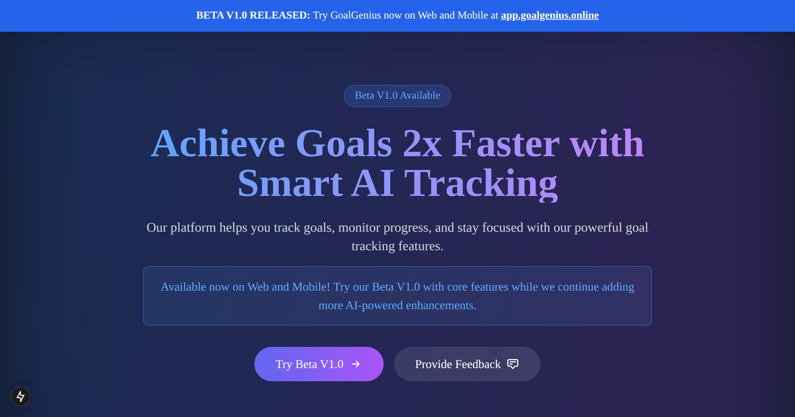

# GoalGenius Website 🌐

<div align="center">

[](https://nextjs.org/)
[](https://www.typescriptlang.org/)
[](https://tailwindcss.com/)
[](https://www.gnu.org/licenses/agpl-3.0)

Official website for GoalGenius - The open-source goal tracking platform.

[Visit Website](https://goalgenius.online) · [Try App](https://app.goalgenius.online) · [View App Repo](https://github.com/ismailco/goalgenius-app)



</div>

## 📋 About

This repository contains the source code for the GoalGenius landing page and documentation website. For the main application code, please visit the [GoalGenius App Repository](https://github.com/ismailco/GoalGenius).

## ✨ Website Features

- 🎯 **Landing Page** - Modern, responsive landing page showcasing GoalGenius features
- 📚 **Documentation** - Comprehensive guides and API documentation
- 💝 **Donation Page** - Support options for the open-source project
- 🌙 **Dark Mode** - Beautiful dark theme with glass-morphism effects
- 📱 **Responsive Design** - Seamless experience across all devices
- 🔍 **SEO Optimized** - Built with Next.js for optimal search engine performance

## 🚀 Getting Started

### Prerequisites

- Node.js 18+
- pnpm (Recommended) - Install with `npm install -g pnpm`
- Git

### Installation

1. Clone the repository
```bash
git clone https://github.com/ismailco/goalgenius-website.git
cd goalgenius-website
```

2. Install dependencies
```bash
pnpm install
```

3. Start the development server
```bash
pnpm dev
```

4. Open [http://localhost:3000](http://localhost:3000) in your browser

## 🛠️ Built With

- **Framework**: [Next.js 13](https://nextjs.org/) - React framework for production
- **Styling**: [Tailwind CSS](https://tailwindcss.com/) - Utility-first CSS framework
- **Animations**: [Framer Motion](https://www.framer.com/motion/) - Production-ready animations
- **Icons**: Custom SVG icons and Heroicons
- **Deployment**: Vercel
- **Package Manager**: [pnpm](https://pnpm.io/) - Fast, disk space efficient package manager

## 📖 Project Structure

```
goalgenius-website/
├── app/                    # Next.js 13 app directory
│   ├── donate/            # Donation page
│   └── ...                # Other pages
├── components/             # Reusable UI components
├── public/                # Static assets
└── ...
```

## 🤝 Contributing

Contributions are welcome! Please feel free to submit a Pull Request. For major changes, please open an issue first to discuss what you would like to change.

1. Fork the Project
2. Create your Feature Branch (`git checkout -b feature/AmazingFeature`)
3. Commit your Changes (`git commit -m 'Add some AmazingFeature'`)
4. Push to the Branch (`git push origin feature/AmazingFeature`)
5. Open a Pull Request

## 📝 License

This project is licensed under the GNU Affero General Public License v3.0 - see the [LICENSE](LICENSE) file for details. The AGPL license ensures that any modifications to the code must be made available to the community, promoting open collaboration and transparency.

## 🔗 Related Projects

- [GoalGenius App](https://github.com/ismailco/goalgenius-app) - The main application repository
- [GoalGenius Mobile](https://github.com/ismailco/goalgenius-mobile) - Mobile app repository (Coming Soon)

## 🙏 Acknowledgments

- [Next.js](https://nextjs.org/)
- [Tailwind CSS](https://tailwindcss.com/)
- [Framer Motion](https://www.framer.com/motion/)
- [Heroicons](https://heroicons.com/)

---

<div align="center">

Made with ❤️ by [Ismail Courr](https://github.com/ismailco)

</div>
