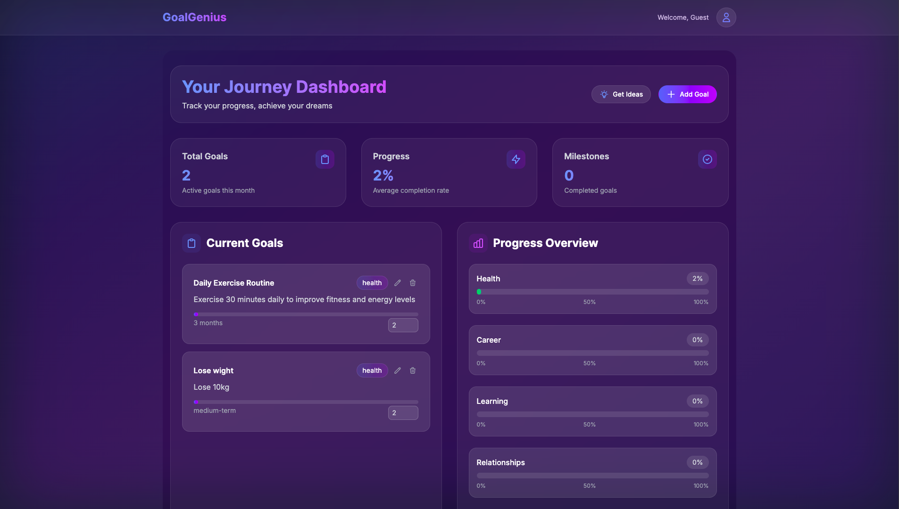
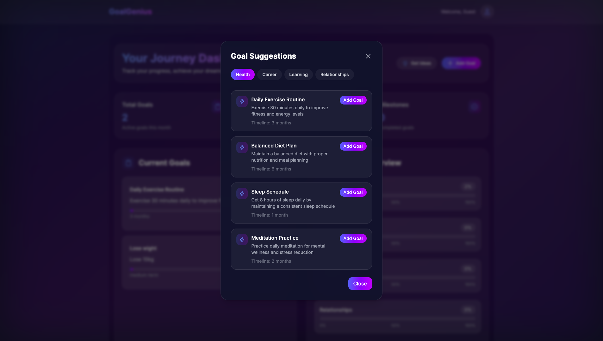

# GoalGenius 🎯✨

GoalGenius is an elegant, AI-powered goal tracking application that helps you transform your aspirations into achievements. Built with modern web technologies and a beautiful glass-morphism design.


## ✨ Features

- **Smart Goal Suggestions** - Get AI-powered goal suggestions tailored to different life areas
- **Visual Progress Tracking** - Track your progress with beautiful, interactive visualizations
- **Glass Morphism UI** - Modern, elegant interface with a stunning glass-like design
- **Responsive Design** - Perfect experience across all devices
- **Real-time Updates** - See your progress update in real-time
- **Category Management** - Organize goals across Health, Career, Learning, and Relationships

## 🚀 Getting Started

1. Clone the repository:
```bash
git clone https://github.com/ismailco/goalgenius.git
```

2. Install dependencies:
```bash
npm install
# or
yarn install
```

3. Run the development server:
```bash
npm run dev
# or
yarn dev
```

Open [http://localhost:3000](http://localhost:3000) with your browser to start achieving your goals!

## 🛠 Tech Stack

- [Next.js 14](https://nextjs.org/) - React Framework
- [Tailwind CSS](https://tailwindcss.com) - Styling
- [TypeScript](https://www.typescriptlang.org/) - Type Safety
- Local Storage - Data Persistence
- AI Integration - Smart Suggestions

## 📱 Screenshots

### Dashboard


### Goal Suggestions


## 🤝 Contributing

Contributions are welcome! Please feel free to submit a Pull Request.

## 📄 License

This project is licensed under the MIT License - see the [LICENSE.md](LICENSE.md) file for details.

## 🙏 Acknowledgments

- Design inspiration from modern glass morphism trends
- AI suggestions powered by advanced language models
- Icons from [Heroicons](https://heroicons.com/)

---

Built with ❤️ by [Ismail Courr](https://github.com/ismailco)
